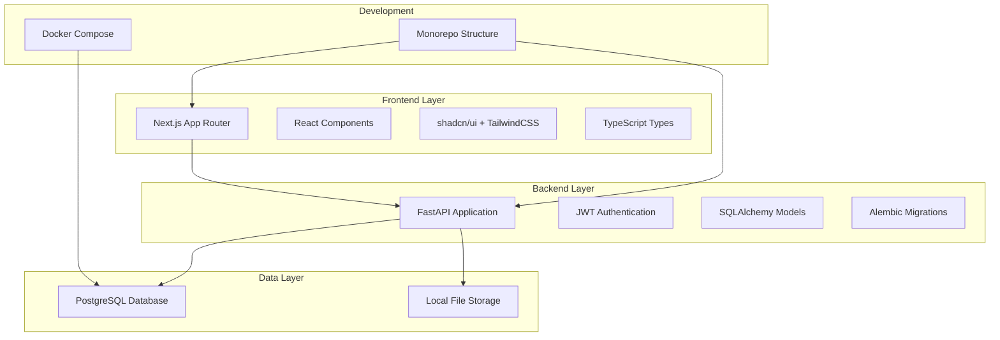
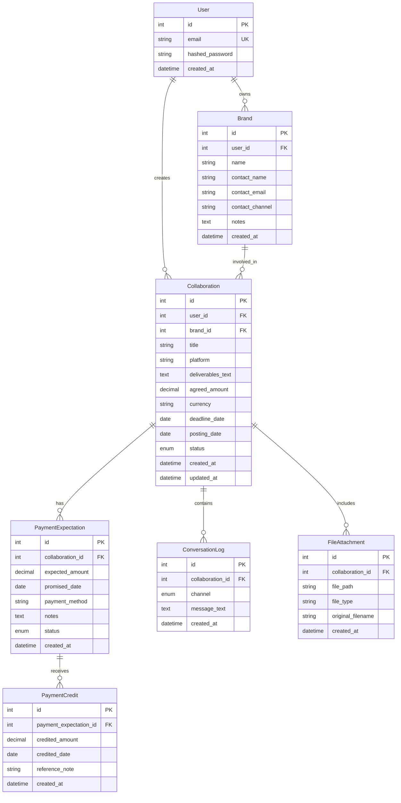

# Design Document: Collab Khata MVP

## Overview

Collab Khata is a mobile-first Progressive Web Application (PWA-like) that enables content creators and influencers to efficiently manage their brand partnerships. The system provides comprehensive tracking of collaborations, payment expectations, communication logs, and file attachments through a modern, responsive interface.

The application follows a monorepo architecture with a clear separation between frontend (Next.js) and backend (FastAPI) components, utilizing PostgreSQL for data persistence and JWT-based authentication for security.

## Architecture

### System Architecture



### Monorepo Structure

```
collab-khata/
├── apps/
│   ├── frontend/          # Next.js application
│   │   ├── src/
│   │   │   ├── app/       # App Router pages
│   │   │   ├── components/ # React components
│   │   │   ├── lib/       # Utilities and API client
│   │   │   └── types/     # TypeScript definitions
│   │   ├── public/
│   │   └── package.json
│   └── backend/           # FastAPI application
│       ├── app/
│       │   ├── api/       # API routes
│       │   ├── models/    # SQLAlchemy models
│       │   ├── schemas/   # Pydantic schemas
│       │   ├── services/  # Business logic
│       │   └── core/      # Configuration and auth
│       ├── alembic/       # Database migrations
│       └── requirements.txt
├── docker-compose.yml     # Development environment
├── README.md
└── package.json           # Root package.json
```

### Technology Stack

- **Frontend**: Next.js 14 (App Router), TypeScript, TailwindCSS, shadcn/ui
- **Backend**: Python FastAPI, SQLAlchemy 2.0, Alembic
- **Database**: PostgreSQL
- **Authentication**: JWT tokens
- **File Storage**: Local filesystem
- **Development**: Docker Compose for PostgreSQL
- **Package Management**: npm/yarn for frontend, pip for backend

## Components and Interfaces

### Database Models

#### User Model
```typescript
interface User {
  id: number
  email: string
  hashed_password: string
  created_at: DateTime
}
```

#### Brand Model
```typescript
interface Brand {
  id: number
  user_id: number
  name: string
  contact_name?: string
  contact_email?: string
  contact_channel?: string
  notes?: string
  created_at: DateTime
}
```

#### Collaboration Model
```typescript
interface Collaboration {
  id: number
  user_id: number
  brand_id: number
  title: string
  platform: string
  deliverables_text?: string
  agreed_amount?: number
  currency: string
  deadline_date?: DateTime
  posting_date?: DateTime
  status: CollaborationStatus
  created_at: DateTime
  updated_at: DateTime
}

enum CollaborationStatus {
  Lead = "Lead"
  Negotiating = "Negotiating"
  Confirmed = "Confirmed"
  InProduction = "InProduction"
  Posted = "Posted"
  PaymentPending = "PaymentPending"
  Overdue = "Overdue"
  Paid = "Paid"
  Closed = "Closed"
}
```

#### Payment Models
```typescript
interface PaymentExpectation {
  id: number
  collaboration_id: number
  expected_amount: number
  promised_date?: DateTime
  payment_method?: string
  notes?: string
  status: PaymentStatus
  created_at: DateTime
}

interface PaymentCredit {
  id: number
  payment_expectation_id: number
  credited_amount: number
  credited_date: DateTime
  reference_note?: string
  created_at: DateTime
}

enum PaymentStatus {
  Pending = "Pending"
  Partial = "Partial"
  Completed = "Completed"
  Overdue = "Overdue"
}
```

#### Communication and File Models
```typescript
interface ConversationLog {
  id: number
  collaboration_id: number
  channel: CommunicationChannel
  message_text: string
  created_at: DateTime
}

interface FileAttachment {
  id: number
  collaboration_id: number
  file_path: string
  file_type: string
  original_filename: string
  created_at: DateTime
}

enum CommunicationChannel {
  Email = "Email"
  Instagram = "Instagram"
  WhatsApp = "WhatsApp"
  Phone = "Phone"
  InPerson = "InPerson"
  Other = "Other"
}
```

### API Endpoints

#### Authentication Endpoints
- `POST /api/auth/register` - User registration
- `POST /api/auth/login` - User login
- `GET /api/auth/me` - Get current user profile

#### Brand Management Endpoints
- `GET /api/brands` - List user's brands
- `POST /api/brands` - Create new brand
- `GET /api/brands/{id}` - Get brand details
- `PUT /api/brands/{id}` - Update brand
- `DELETE /api/brands/{id}` - Delete brand

#### Collaboration Endpoints
- `GET /api/collaborations` - List collaborations with filters
- `POST /api/collaborations` - Create new collaboration
- `GET /api/collaborations/{id}` - Get collaboration details
- `PUT /api/collaborations/{id}` - Update collaboration
- `PATCH /api/collaborations/{id}/status` - Update collaboration status

#### Payment Endpoints
- `GET /api/collaborations/{id}/payments` - List payment expectations
- `POST /api/collaborations/{id}/payments` - Create payment expectation
- `POST /api/payments/{id}/credits` - Record payment credit
- `GET /api/payments/overdue` - Get overdue payments

#### Communication and File Endpoints
- `GET /api/collaborations/{id}/conversations` - List conversation logs
- `POST /api/collaborations/{id}/conversations` - Add conversation log
- `POST /api/collaborations/{id}/files` - Upload file attachment
- `GET /api/files/{id}` - Download file attachment

#### Dashboard Endpoint
- `GET /api/dashboard` - Get financial summary and statistics

### Frontend Components

#### Page Components
- `LoginPage` - User authentication
- `RegisterPage` - User registration
- `DashboardPage` - Financial overview and statistics
- `BrandsListPage` - Brand management interface
- `CollaborationsListPage` - Collaboration listing with filters
- `CollaborationDetailPage` - Detailed collaboration view
- `CreateCollaborationPage` - New collaboration form

#### Shared Components
- `AuthGuard` - Route protection wrapper
- `MobileNavigation` - Bottom navigation for mobile
- `StatusBadge` - Collaboration status indicator
- `PaymentModal` - Payment expectation and credit forms
- `ConversationModal` - Communication log entry form
- `FileUploadModal` - File attachment interface
- `LoadingSpinner` - Loading state indicator
- `ErrorBoundary` - Error handling wrapper

## Data Models

### Database Schema Relationships



### Business Logic Rules

#### Status Transition Workflow
The collaboration status follows a strict workflow:
1. **Lead** → **Negotiating**: When initial contact is established
2. **Negotiating** → **Confirmed**: When terms are agreed upon
3. **Confirmed** → **InProduction**: When content creation begins
4. **InProduction** → **Posted**: When content is published (requires posting_date)
5. **Posted** → **PaymentPending**: When payment is expected
6. **PaymentPending** → **Overdue**: When promised payment date passes
7. **PaymentPending/Overdue** → **Paid**: When all payments are credited
8. **Paid** → **Closed**: When collaboration is complete

#### Payment Calculation Logic
- Payment expectations can have multiple credits (partial payments)
- Status calculation: `sum(credits) < expected_amount` = Partial, `sum(credits) >= expected_amount` = Completed
- Overdue detection: `promised_date < current_date AND status != Completed`

#### Dashboard Calculations
- **Total Expected**: Sum of all payment expectations across active collaborations
- **Total Credited**: Sum of all payment credits
- **Pending Amount**: Total Expected - Total Credited
- **Overdue Count**: Count of payment expectations past promised date

## Correctness Properties

*A property is a characteristic or behavior that should hold true across all valid executions of a system—essentially, a formal statement about what the system should do. Properties serve as the bridge between human-readable specifications and machine-verifiable correctness guarantees.*

### Property Reflection

After analyzing all acceptance criteria, I identified several areas where properties can be consolidated:

- Authentication properties (1.1-1.6) can be grouped into authentication success/failure patterns
- CRUD operations across different entities (brands, collaborations, payments) follow similar patterns
- Data isolation properties appear across multiple entities and can be consolidated
- Payment calculation properties (4.3-4.5) are related and can be combined into comprehensive payment state management

### Authentication and Authorization Properties

**Property 1: User registration with valid data creates account**
*For any* valid email and password combination, registering a new user should create a user account with proper data persistence and return success
**Validates: Requirements 1.1**

**Property 2: Duplicate email registration prevention**
*For any* email address that already exists in the system, attempting to register with that email should fail and return an appropriate error
**Validates: Requirements 1.2**

**Property 3: Valid credentials authentication**
*For any* registered user with correct credentials, authentication should succeed and return a valid JWT token
**Validates: Requirements 1.3**

**Property 4: Invalid credentials rejection**
*For any* invalid credential combination (wrong email, wrong password, or non-existent user), authentication should fail and return an appropriate error
**Validates: Requirements 1.4**

**Property 5: Protected resource access with valid token**
*For any* protected endpoint and valid JWT token, the request should be authorized and processed successfully
**Validates: Requirements 1.5**

**Property 6: Protected resource access without valid token**
*For any* protected endpoint accessed without a valid JWT token, the request should be denied with an authentication error
**Validates: Requirements 1.6**

### Data Management and Isolation Properties

**Property 7: Entity creation and persistence**
*For any* valid entity data (brand, collaboration, payment expectation, conversation log, file attachment), creating the entity should persist all provided data and associate it with the correct user
**Validates: Requirements 2.1, 3.1, 4.1, 5.1, 6.1**

**Property 8: Data isolation by user**
*For any* user and any entity type, querying entities should return only those associated with that user and never return entities belonging to other users
**Validates: Requirements 2.2, 2.5, 5.5, 6.6, 7.6**

**Property 9: Entity updates preserve data integrity**
*For any* entity update operation, the changes should be persisted correctly while preserving unchanged fields and updating modification timestamps where applicable
**Validates: Requirements 2.3, 5.3**

**Property 10: Input validation prevents invalid data**
*For any* entity creation or update with invalid or missing required data, the operation should fail with appropriate validation errors
**Validates: Requirements 2.4, 6.4, 9.2**

### Collaboration Status and Workflow Properties

**Property 11: Status transition workflow validation**
*For any* collaboration status update, the transition should only succeed if it follows the defined workflow: Lead → Negotiating → Confirmed → InProduction → Posted → PaymentPending → Overdue → Paid → Closed
**Validates: Requirements 3.2**

**Property 12: Posted status requires posting date**
*For any* collaboration being updated to Posted status, the operation should require a valid posting_date to be provided
**Validates: Requirements 3.3**

**Property 13: Paid status requires full payment**
*For any* collaboration transitioning to Paid status, all associated payment expectations should be fully credited
**Validates: Requirements 3.4**

### Payment Management Properties

**Property 14: Payment expectation and credit relationship**
*For any* payment expectation, adding credits should properly associate with the expectation and update the remaining balance calculation
**Validates: Requirements 4.2, 4.4**

**Property 15: Payment status calculation**
*For any* payment expectation, the status should be calculated correctly: Pending (no credits), Partial (credits < expected), Completed (credits >= expected), Overdue (past promised date and not completed)
**Validates: Requirements 4.3, 4.5**

**Property 16: Multiple payment expectations per collaboration**
*For any* collaboration, multiple payment expectations should be properly associated and managed independently
**Validates: Requirements 4.6**

### Dashboard and Financial Calculation Properties

**Property 17: Financial summary calculations**
*For any* user's dashboard, the financial summaries should accurately reflect the sum of all payment expectations, credited amounts, and pending balances across all collaborations
**Validates: Requirements 7.1, 7.2**

**Property 18: Overdue payment identification**
*For any* payment expectation with a promised date in the past and status not Completed, it should be identified and displayed as overdue
**Validates: Requirements 7.3**

**Property 19: Collaboration status aggregation**
*For any* user's dashboard, the collaboration counts by status should accurately reflect the current status distribution of all user's collaborations
**Validates: Requirements 7.4**

**Property 20: Real-time dashboard updates**
*For any* change to underlying collaboration or payment data, the dashboard calculations should reflect the updated values immediately
**Validates: Requirements 7.5**

### Data Persistence and API Properties

**Property 21: CRUD operation persistence**
*For any* create, update, or delete operation on any entity, the changes should be properly persisted to the PostgreSQL database and be retrievable in subsequent queries
**Validates: Requirements 9.1**

**Property 22: API response consistency**
*For any* API request, the response should include appropriate HTTP status codes, proper error messages for failures, and consistent data formats for successes
**Validates: Requirements 9.2, 9.5**

### File Management Properties

**Property 23: File upload and storage**
*For any* valid file upload, the file should be stored in the local filesystem with a unique path and a corresponding database record should be created with proper metadata
**Validates: Requirements 6.1**

**Property 24: File retrieval and serving**
*For any* uploaded file, it should be retrievable through its attachment record and served correctly when requested
**Validates: Requirements 6.2, 6.3**

**Property 25: File type and size validation**
*For any* file upload, the system should validate file type against supported formats and reject files exceeding size limits with appropriate errors
**Validates: Requirements 6.4, 6.5**

### Conversation and Communication Properties

**Property 26: Conversation log chronological ordering**
*For any* collaboration with multiple conversation logs, they should be displayed in chronological order based on creation timestamp
**Validates: Requirements 5.2**

**Property 27: Communication channel support**
*For any* conversation log entry, it should accept and properly store any of the supported communication channels (Email, Instagram, WhatsApp, Phone, InPerson, Other)
**Validates: Requirements 5.4**

## Error Handling

### Error Categories and Responses

#### Authentication Errors (401)
- Invalid credentials during login
- Missing or expired JWT tokens
- Malformed authentication headers

#### Authorization Errors (403)
- Accessing resources belonging to other users
- Insufficient permissions for requested operations

#### Validation Errors (400)
- Missing required fields in request bodies
- Invalid data formats or types
- Business rule violations (e.g., invalid status transitions)
- File size or type restrictions

#### Not Found Errors (404)
- Requesting non-existent resources
- Invalid resource IDs in URL parameters

#### Conflict Errors (409)
- Duplicate email registration attempts
- Concurrent modification conflicts

#### Server Errors (500)
- Database connection failures
- File system operation failures
- Unexpected application errors

### Error Response Format

All API errors follow a consistent JSON format:

```json
{
  "error": {
    "code": "VALIDATION_ERROR",
    "message": "Invalid input data",
    "details": {
      "field": "email",
      "reason": "Email address is already registered"
    }
  }
}
```

### Error Handling Strategies

#### Frontend Error Handling
- Global error boundary for React component errors
- API error interceptors for consistent error display
- User-friendly error messages with actionable guidance
- Retry mechanisms for transient failures
- Offline state handling for PWA functionality

#### Backend Error Handling
- Structured exception hierarchy with custom exception classes
- Automatic error logging with request context
- Database transaction rollback on errors
- Graceful degradation for non-critical failures
- Health check endpoints for monitoring

## Testing Strategy

### Dual Testing Approach

The testing strategy employs both unit testing and property-based testing as complementary approaches:

- **Unit tests**: Verify specific examples, edge cases, and error conditions
- **Property tests**: Verify universal properties across all inputs
- Together they provide comprehensive coverage where unit tests catch concrete bugs and property tests verify general correctness

### Property-Based Testing Configuration

**Library Selection**: 
- **Backend**: Hypothesis for Python (FastAPI/SQLAlchemy testing)
- **Frontend**: fast-check for TypeScript/JavaScript (React component and utility testing)

**Test Configuration**:
- Minimum 100 iterations per property test due to randomization
- Each property test references its design document property
- Tag format: **Feature: brand-collaboration-tracker, Property {number}: {property_text}**
- Each correctness property implemented by a single property-based test

### Unit Testing Strategy

**Backend Unit Tests (pytest)**:
- API endpoint testing with test client
- Database model validation and relationship testing
- Authentication and authorization flow testing
- File upload and storage mechanism testing
- Business logic validation (status transitions, payment calculations)

**Frontend Unit Tests (Jest + React Testing Library)**:
- Component rendering and interaction testing
- Form validation and submission testing
- API integration and error handling testing
- Navigation and routing testing
- Mobile responsiveness testing (viewport simulation)

### Integration Testing

**API Integration Tests**:
- End-to-end workflow testing (user registration → collaboration creation → payment tracking)
- Database transaction integrity testing
- File upload and retrieval integration testing
- Authentication flow integration testing

**Frontend Integration Tests**:
- Page-to-page navigation testing
- API integration with mock backend
- Form submission and data persistence testing
- Error boundary and error handling testing

### Test Data Management

**Database Testing**:
- Isolated test database for each test run
- Database fixtures for consistent test data
- Transaction rollback after each test
- Factory patterns for generating test entities

**File System Testing**:
- Temporary directories for file upload testing
- Cleanup procedures for test files
- Mock file objects for unit testing
- File size and type validation testing

### Performance and Load Testing

**API Performance**:
- Response time benchmarks for critical endpoints
- Database query optimization validation
- File upload performance testing
- Concurrent user simulation

**Frontend Performance**:
- Page load time measurement
- Bundle size optimization validation
- Mobile performance testing
- Progressive Web App functionality testing

### Testing Implementation Requirements

Each correctness property must be implemented as a property-based test with proper tagging and iteration configuration. Unit tests should focus on specific examples and edge cases while property tests validate universal behaviors across randomized inputs.